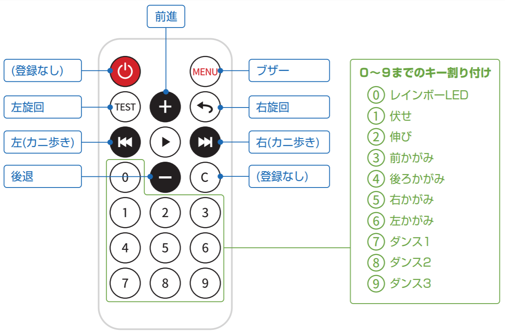
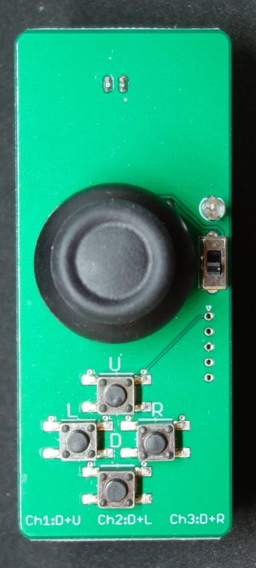

## クアッドクローラー リモコン操作方法
### 標準リモコン
 
標準リモコンは対戦に対応していません、２台のロボットで対戦するときはアナログリモコンを使って下さい。

### アナログリモコン
 
| ボタン |  動作  |
| ---- | ---- |
| ジョイスティック | 歩行 |
| ジョイスティック押し込み | 伸び |
| Uボタン | ダンス１ |
| Lボタン | ダンス２ |
| Rボタン | ダンス３ |
| Dボタン押しながら ジョイスティック | ポーズ |

２組（又は３組）のクアッドクローラーとアナログリモコンを使うことでロボットを対戦させて遊ぶことができます。

#### 1. アナログリモコンのチャンネル設定（１回だけ）
２つ（又は３つ）のアナログリモコンそれぞれにチャンネル番号１，２，３を設定して下さい。設定はリモコンの電源を切っても記憶されます。

| リモコンチャンネル設定 | 設定方法 |
| ---- | ---- |
| チャンネル１(Ch1) | DとUボタンを２秒押し |
| チャンネル２(Ch2) | DとLボタンを２秒押し |
| チャンネル３(Ch3) | DとRボタンを２秒押し |

リモコンの電源スイッチをOFFして、ONして下さい、電源LEDで設定チャンネルを確認することが出来ます。
| リモコンチャンネル設定 | 電源LED |
| ---- | ---- |
| チャンネル１(Ch1) | 1回点滅 |
| チャンネル２(Ch2) | 2回点滅 |
| チャンネル３(Ch3) | 3回点滅 |

#### 2. クアッドクローラーのチャンネル設定（電源ONごと）
クアッドクローラーの電源を入れ、最初に操作したアナログリモコンのチャンネル番号に設定されます。
２台（又は３台）のロボットで対戦する場合、 「クアッドクローラー❘の電源を入れ、対応するアナログリモコンで操作」 を1台ずつ繰り返して下さい。
